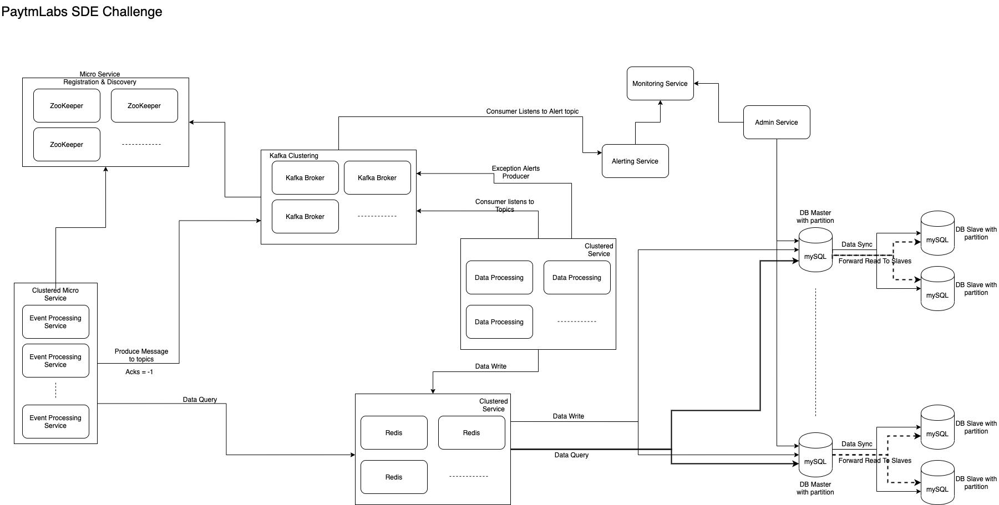

# PaytmLabs SDE Challenge

## Coding Question

Write an interface for a data structure that can provide the moving average of the last N elements added, add elements to the structure and get access to the elements. Provide an efficient implementation of the interface for the data structure.

### Minimum Requirements

1. Provide a separate interface (IE `interface`/`trait`) with documentation for the data structure
2. Provide an implementation for the interface
3. Provide any additional explanation about the interface and implementation in a README file.

## Answer: 
    1. To meet the request of this question, LinkedList is the best data structure of storing all the elements. 
        Because it is easy to add and remove elements.
    2. Leveraging the features of Queue and LinkedList is to easily operate on the Collection, because of FIFO.
    3. LinkedList is efficient to make operations on add / remove operations.
    4. MovingAverageService provides the function addElement() to add single element appending at the end of current Collection. 
    5. MovingAverageService provides the function getAverageLastN() to calculate the last N elements of the collection precisely. 
        This function doesn't restrict the size of moving window, but dynamically deals with the last N elements with efficiency.
    6. MovingAverageService provides the function getAllElements() to access all the elements added from the beginning, 
        rather than to only return the last N elements. This function can track all the elements without any data missing.
    7. MovingAverageServiceImpl creates a temprary queue when to calculate average value of last N element, 
        rather than to operate on the original data Queue. By this way, we can guaratee the original data is not polluted .
## Design Question

Design A Google Analytic like Backend System.
We need to provide Google Analytic like services to our customers. Please provide a high level solution design for the backend system. Feel free to choose any open source tools as you want.

### Requirements

1. Handle large write volume: Billions of write events per day.
2. Handle large read/query volume: Millions of merchants wish to gain insight into their business. Read/Query patterns are time-series related metrics.
3. Provide metrics to customers with at most one hour delay.
4. Run with minimum downtime.
5. Have the ability to reprocess historical data in case of bugs in the processing logic.

## Solution
   1.   Using the distributed Kafka streaming to properly handle the high volume write operations async. Thus, for the billions of write events, the data processing service
        can take care of the operation smoothly, and the client facing service Event Processing Service can respond the client without latency.
        Moreover, Kafka partition and replica feature can help reducing the risk of service down, and help to improve the performance of streaming.
   2.   Using ZooKeeper to handle micro service registration and discovery, including Kafka brokers. Thus, client can discover the services easily.
   3.   Using Redis as caching solution for read and write process between application and MySQL DB. Redis can effectively take care data query from cache rather than Disk.
   4.   Using MySQL as the DB to store the data. Meanwhile, leveraging MySQL DB partition feature to partition data by Date (Or hour) to balance the read operation.
        Using Master-slave mode of MySQL, master for write operation. Slaves for read operation to balance the IO.
   5.   Using clustering nodes for all the micro services to reduce the service down risk, and load balancing the traffics.
   6.   Add the Alert service, monitoring service and admin service to enable the ability to reprocess historical data in case of bugs in processing logic.
   

## Design Diagram

